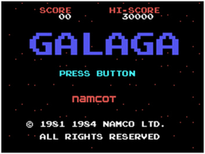
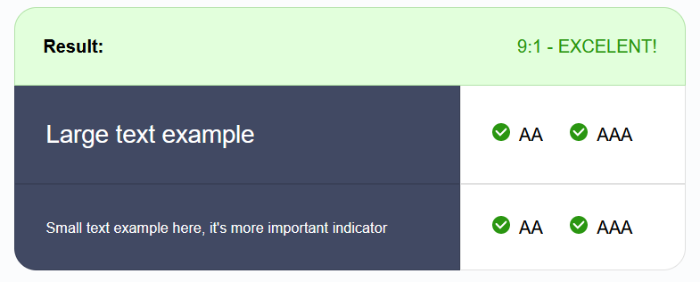
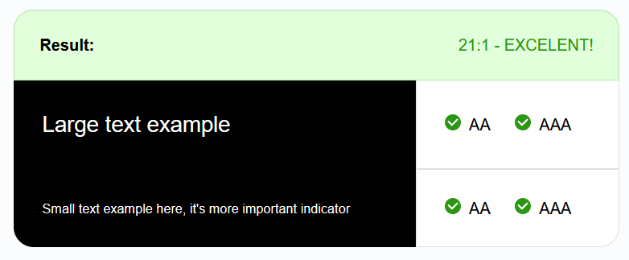
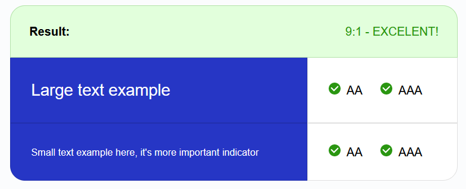
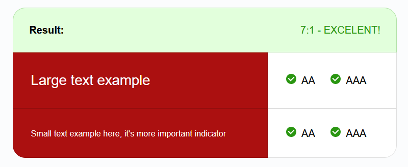

# Rock, paper, sissors, lizard, spock
This game is an extention to the classic Rock, paper, scssors game. This extention is used in the tv-show The Big Bang Theory. The additions in this version are "lizard" and "spock" (from Star Trek The Original Series). The rules copied from [The Big Bang Theory Wiki](https://bigbangtheory.fandom.com/wiki/Rock,_Paper,_Scissors,_Lizard,_Spock) are:

    Scissors cuts Paper
    Paper covers Rock
    Rock crushes Lizard
    Lizard poisons Spock
    Spock smashes Scissors
    Scissors decapitates Lizard
    Lizard eats Paper
    Paper disproves Spock
    Spock vaporizes Rock
    Rock crushes Scissors

## UX - User Experience

### User stories
I want the user to:
- Play an entertaining game
- Be able to choose how many points are needed to win a round
- See the rules at all times
- See scores and choices each round

### Colour
I chose a dark blue colour and black for backgrounds. The instruction page has a black background and the page where you play the game has a dark blue one. The "game-window" has a black background with a lightblue border to make it look like a screen inspired by Star Trek TOS (the original series). The buttons are either blue or red. Red is for the different choices and blue is for the rest of the buttons. All text is white.

### Structure and typography
I wanted the game to look a bit like an older game, and be inspired by Star Trek TOS. To accive that I chose a font that looked very retro and tryled the game window like one of the screens in Star Trek. 

#### Structure
For the layout of the page i chose to create a game window with a border around it. This is how a lot of remakes of older games looks. The window is also shaped with round corners, just like the screens in Star Trek. I chose to have the rules accessable at all times due to this version/extention of the classic "Rock, paper, sissors" game. The only ones who really knows how it works are viewers of The Big Bang Theory. In order to avoid confusion about the result I chose to have the rules easily accessable at all times. On desktop, they are placed to the right of the game window, and on mobile and smaller screens, they are placed below the game window. The starting page was inspired by the starting pages of old 8-, and 16-bit games.

#### Typography
The font i chose is called Orbitron (the san serif version, since it is easier to read on a screen). The letters are shaped the same way they were in older games, but less pixelated. This gives the game a retro feel while not looking too old and pixelated. I found the font on [Google fonts](https://fonts.google.com/specimen/Orbitron?query=orbitron).

## Features
The game is simple with one starting page and one game page with 3 windows. One window for choosing how many points is needed to win a game, one for the game itself, and one for the result of the game. 

### Starting/instruction page
This page was made to give the user instructions on how to play the game. In some games, especially older ones, you are not given all instructions on how to play the game. It is a lot of trial and error. Even if i want to give this game a retro feel, this is one of the things i dont want to replicate. An instruction page also keeps the user from getting frustrated and/or annoyed.

### Point choosing window
I have chosen to have this game work like when kids play rock, paper, sissors. You play until on of you gets 3 points. But instead of just making the user play to 3, they can choose to play to 3, 5 and 10. This is chosen on this window. If non of the options gets chosen, an alert, telling you to choose an option, pops up when you click the blue button.

### Game window
When the user has chosen the points needed to win, they play the game itself. This is done on this window. When you choose aone of the options you get to know who won the round and the winner gets one point. Then you click continue to play another round. this continues until you or the computer have enough points to win. When that happens the continue button sends you to the result window.

### Result window
This window shows who won and also gives the user the option to start a new game.

### Rules
The rules are displayed as long as you are on the game.html page. Depending on which device you are on the placement might be a bit different, but the rules are always accessible. This is to avoid confusion, since this game is from a tv-show that not everyone has seen. By always showing the rules I can avoid the user getting confused about why for example spock wins against rock. The information is right there and the user can understand the logic. 

### Features left to implement
- I would like to add some more choices that the user can make.
- And maybe make it possible for the user to play against a friend IRL.

## Testing

### User stories
The user was able to:
- Play an entertaining game
  - Assuming the user finds a game of rock, paper, sissors, lizard, spock entertaining, they will be entertained by this.
- Be able to choose how many points are needed to win a round
  - This is one of the features of the game. You can choose between 3, 5, and 10 points.
- See the rules at all times
  - The rules are always there when you play the game.
- See scores and choices each round
 - The game shows how many points each player has and what choice each player made each round. It also shows who got the point.

### Device testing
The game has been tested on multiple devices using the mozilla dev tools. These are the devices:
- iPhone SE (2:nd generation)
- iPhone 11 (Pro + Pro Max)
- iPhone 13 (Pro Max + Mini)
- Samsung Galaxy Note 10
- Samsung Galaxy S10/S10+
- Samsung Galaxy S20
- iPad

The game was also tested (natively) on these devices:
- iPhone SE (2:nd generation)
- Samsung Galaxy S9
- iPad
- ACER Aspire 5 15 inch (laptop)
- Desktop computer (Windows 10)

### Browser testing
The game was tested on these browsers:
- Mozilla Firefox
- Safari
- Google crome
- DuckDuckGo mobile browser

### Peer review
I asked some people I know to test the game. They found some small issues with the media querries, but did not find much wrong with the game itself.
One of the people I asked said that they liked the retro style of the game. Another person said it would be nice to get some feedback on how many points are chosen. This was later inplemented.

### Validator testing

#### Code

#### Contrast and more
I checked all colours in the [accessibility checker](https://www.accessibilitychecker.org/color-contrast-checker/). Their colour contrast checker tells you if the background and forground (the text) has a large enough contrast. If it does not have enough contrast, it will be very hard for people with bad eyesight to read.
- Validation for the dark blue background.

- Validation for the black background.

- Validation for the blue buttons.

- Validation for the red buttons.

### Fixed bugs
- I had a problem where all rules wouldnt show up propperly on mobile. I solved this by changing the size of the game window in order to make more space for the rules. 
![Bug rules]

### Unfixed bugs

### Deployment
This game was deployed to github pages.

- Open the repository setting on.
- Go to "pages" (found under "code and automation").
- Choose which branch to build from. You want to choose "main". Do not forget to save the settings.
- (If needed, choose a custom domain)
- Open the repository in github desktop (I used github desktop. You can do this in git too.)
- Choose to create a local clone (the first time you open your repository in github desktop, there should be a window asking if you want to create a clone)
- Copy the link to your deployed website (can be found in the github pages settings, where you chose which branch to build from) and make sure it is operating as expected.
- The deployed website will now be updated when you push anything new to the repository.

### Credits
The rules for the game are copied from [The Big Bang Theory Wiki](https://bigbangtheory.fandom.com/wiki/Rock,_Paper,_Scissors,_Lizard,_Spock), and the font (Orbitron, san serif) is from [Google fonts](https://fonts.google.com/specimen/Orbitron?query=orbitron). The layout is inspired by Star Trek TOS by Gene Roddenberry. 
