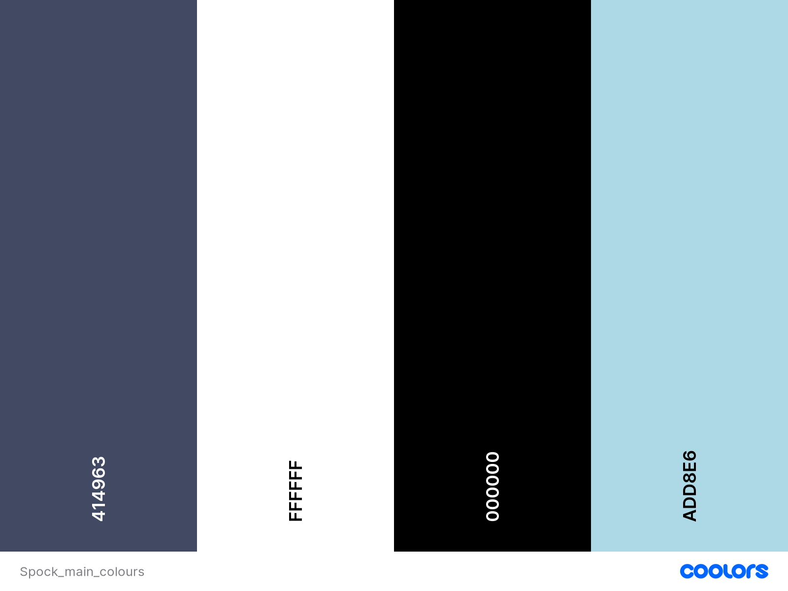
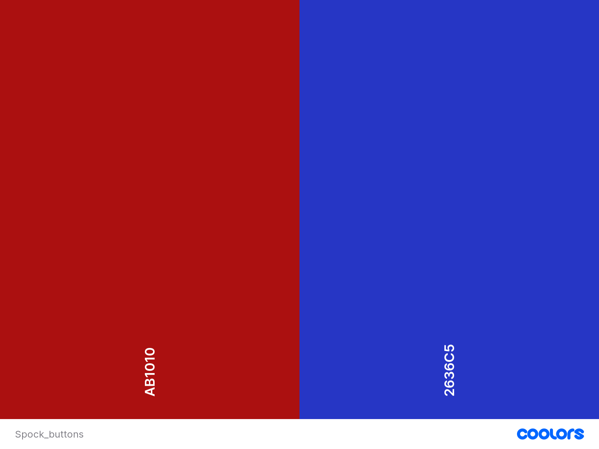
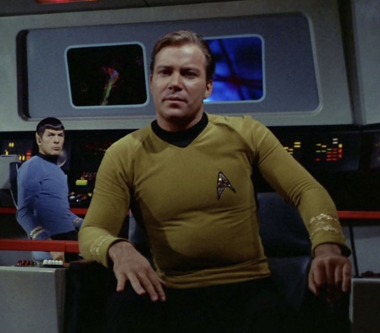
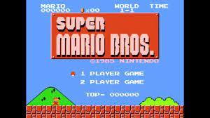

# Rock, paper, sissors, spock

## UX - User Experience

### User stories
I want the user to:
- Play an entertaining game
- Be able to choose how many points are needed to win a round
- See the rules at all times
- See scores and choices each round

### Colour
I chose a dark blue colour and black for backgrounds. The instruction page has a black background and the page where you play the game has a dark blue one. The "game-window" has a black background with a lightblue border to make it look like a screen inspired by Star Trek TOS (the original series). The buttons are either blue or red. Red is for the different choices and blue is for the rest of the buttons. All text is white.

### Structure and typography
I wanted the game to look a bit like an older game, and be inspired by Star Trek TOS. To accive that I chose a font that looked very retro and tryled the game window like one of the screens in Star Trek. 

#### Structure
For the layout of the page i chose to create a game window with a border around it. This is how a lot of remakes of older games looks. The window is also shaped with round borders, just like the screens in Star Trek. I chose to have the rules accessable at all times due to this version/extention of the classic "Rock, paper, sissors" game. The only ones who really knows how it works are viewers of The Big Bang Theory. In order to avoid confusion about the result I chose to have the rules easily accessable at all times. On desktop, they are placed to the right of the game window, and on mobile and smaller screens, they are placed below the game window. The starting page was inspired by the starting pages of old 8-, and 16-bit games.

#### Typography
The font i chose is called Orbitron (the san serif version, since it is easier to read on a screen). The letters are shaped the same way they were in older games, but less pixelated. This gives the game a retro feel while not looking too old and pixelated. I found the font on [Google fonts](https://fonts.google.com/specimen/Orbitron?query=orbitron).

## Features

### Starting/instruction page

### Point choosing page

### Game page

### Result page

### Rules

## Testing

### User stories

### Device testing

### Browser testing

### Peer review

### Validator testing

#### Code

#### Contrast and more

### Credits
The rules for the game are copied from [The Big Bang Theory Wiki](https://bigbangtheory.fandom.com/wiki/Rock,_Paper,_Scissors,_Lizard,_Spock), and the font (Orbitron, san serif) is from [Google fonts](https://fonts.google.com/specimen/Orbitron?query=orbitron). The layout is inspired by Star Trek TOS by Gene Roddenberry. 
